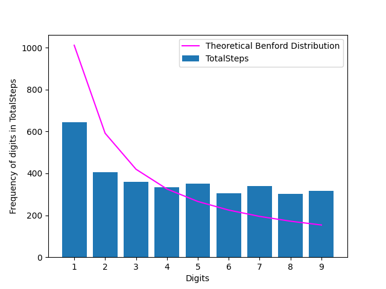
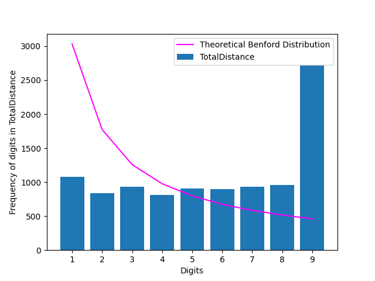
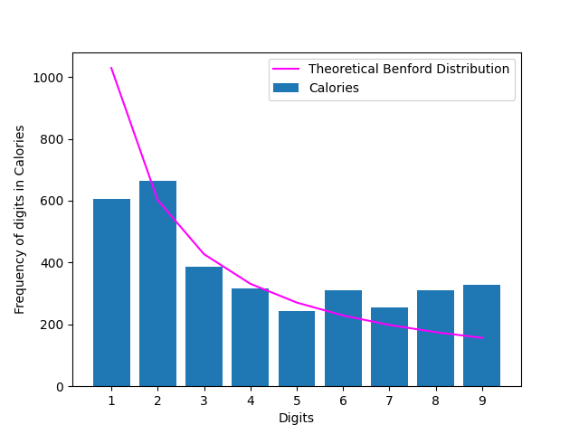
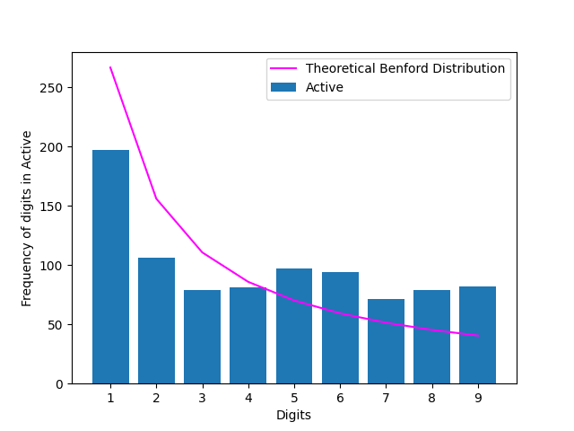
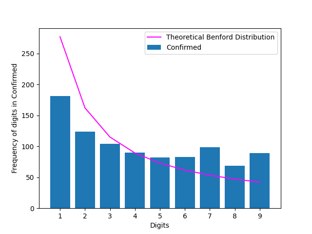
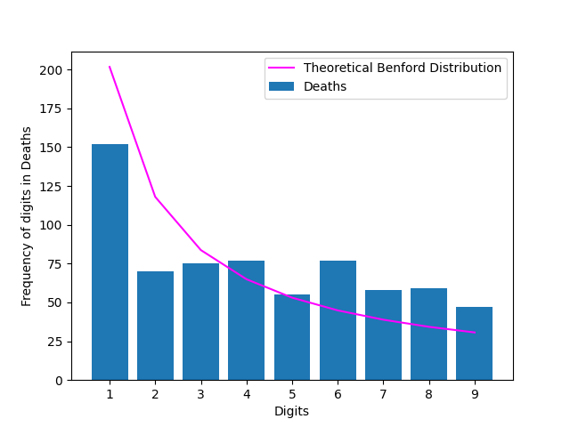

<h1>Examples:</h1>

Distributions for variables obtained from the FitBit Tracker Data

Variable - Total Steps:

Variable - Total Distance:

Variable - Calories:

Distributions for variables obtained from the COVID Data

Variable - US Active Cases:

Variable - US Confirmed Cases:

Variable - US Deaths:

